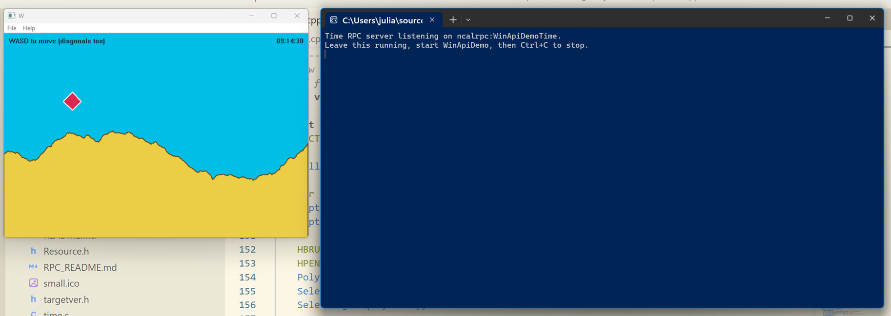

# WinApiDemo



WinApiDemo is a self-contained Win32 C++ application demonstrating a WASD-controlled sprite over a randomly generated mountain background, utilizing raw Win32 APIs and GDI for double-buffered rendering. It also features inter-process communication (IPC) for fetching the current time via MS-RPC or optionally via ZeroC Ice across a network.

## Features

- **Win32 & GDI Rendering**: Draws a mountain silhouette using 1D midpoint displacement. The scene is double-buffered to a memory device context (DC) to prevent flickering. No external UI frameworks are used (pure WinAPI).
- **Bitmap Sprite**: Uses `TransparentBlt` (`Msimg32.lib`) to draw a diamond sprite with a transparent colorkey.
- **Robust Game Loop**: Utilizes `QueryPerformanceCounter` for delta-time measurements and `MsgWaitForMultipleObjects` to sleep without blocking the message pump, achieving smooth 60fps frame timing.
- **SSE2 Intrinsics**: Uses branchless SSE2 `MAXSD`/`MINSD` for clamping the sprite bounds efficiently.
- **Clipboard Integration**: Pressing `TAB` copies the current canvas to the system clipboard as a Device-Independent Bitmap (`CF_DIB`).
- **Metafile Export**: Pressing `ESC` saves the current scene as a placeable Windows Metafile (`capture.wmf`).
- **RPC Time Client**: Features a live clock in the corner fetched from a separate process via RPC.

## Project Structure

- `WinApiDemo.cpp` - The main Win32 window and rendering game loop.
- `time.c` - An MS-RPC server console application that provides the local time.
- `Timesvc.idl` / `Timesvc.acf` - Interface definitions for the MS-RPC time service.
- `RPC_README.md` - Detailed instructions on building and running the MS-RPC components.
- `ice/` - A subfolder containing an alternative ZeroC Ice cross-machine RPC implementation.

## The `ice` Subfolder (ZeroC Ice)

While the default time service relies on MS-RPC (`ncalrpc`), which is restricted to local inter-process communication on the same machine, the `ice` subfolder demonstrates an **Object Request Broker (ORB)** approach using **ZeroC Ice**. 

This allows the time service to be hosted on a remote machine (e.g., an Ubuntu server) and queried by the Windows client over plain TCP. 

Inside the `ice` directory:
- `Time.ice` - The Slice IDL definition for the `TimeSvc` object.
- `server.cpp` - The C++ Ice server implementation (intended for Linux/Ubuntu).
- `client.cpp` - A sample Windows console client to test the Ice connection.
- `README.md` - Instructions for setting up ZeroC Ice on both Ubuntu and Windows, and how to integrate the Ice proxy into `WinApiDemo.cpp`.

## Building

The project can be built using CMake or Visual Studio.
For CMake (Developer Command Prompt):
```bat
cmake -S . -B build -A x64
cmake --build build --config Debug
```
This builds both the `TimeServer.exe` and `WinApiDemo.exe`. Run the server first, then the client.

For more details on RPC compilation, refer to `RPC_README.md`.
